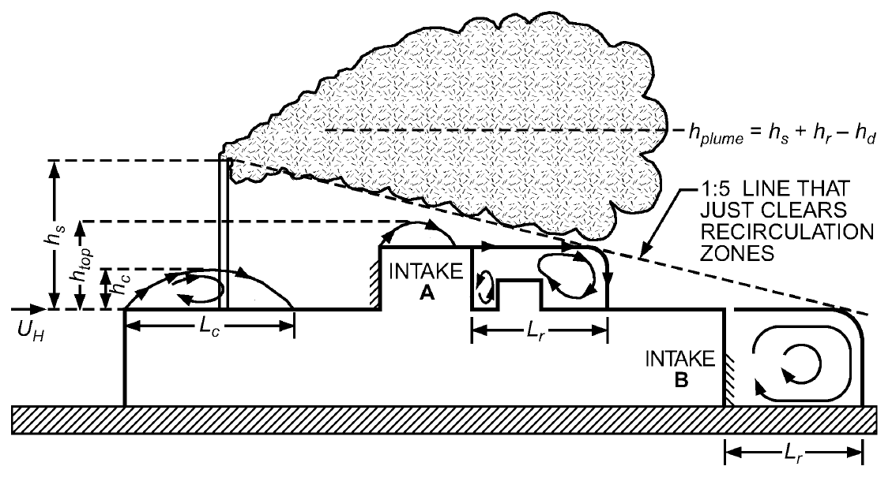
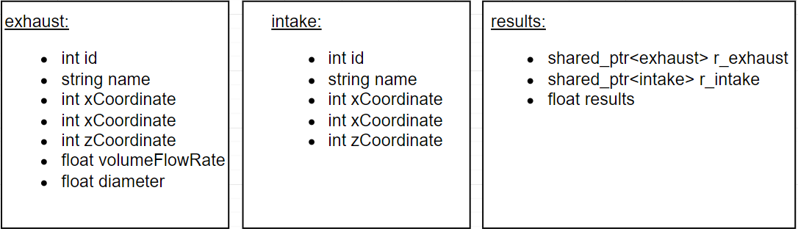
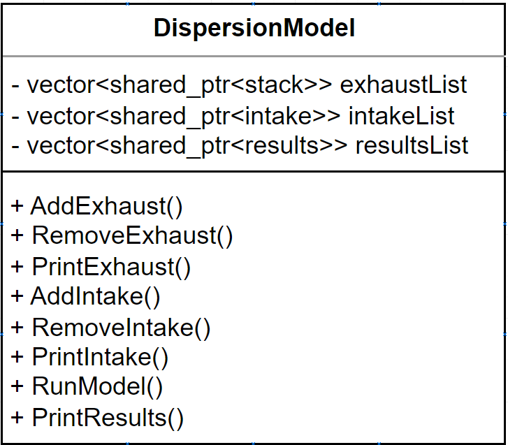

# Numerical Dispersion Modeling Data Stucture

Clean air enters a building through air intakes, while exhausts remove air contaminants and dilute them with the wind. However, these exhaust stacks may occasionally emit chemicals or other contaminants that can enter same building or nearby buildings through air intakes or impact sensitive locations, posing a risk to staff and the public.

An example of contaminants emitted from building exhaust is shown in the Figure below.



Mathematical equations are available in the literature for predicting exhaust concentrations, and __the objective of this project is to develop a data structure for a numerical dispersion model.__


### Data Structure
Below is a summary of the three data structures that were specifically built for this project:

* __exhaust__: Contains exhaust source ID, name, location, volume flow rate, diameter.
* __intake__: Contains air intake ID, name, location.
* __results__: For each Exhaust/Intake Combo, stores pointer location to the stack and Intake, In addition to dilution results for this combo.

Memebers of the data structure are also summarized in the figure below:




### Dispersion Model Class

### Private Data Members
The private data members of the program store Exhausts, Intakes, and Results in C++ vectors, which were chosen due to their dynamic implementation and built-in functions for quick data manipulation such as adding, removing, and sorting. Additionally, since the typical data used by the program is relatively small with fewer than 20 stacks, 50 receptors, and a maximum of 100 result combinations, the use of more complex data structures such as linked lists or trees is not necessary.

Below is a summary of the private data members available in the class.


* __exhaustList__: C++ Vector stores pointers of every exhaust .
* __intakeList__: C++ Vector stores pointers of every intake.
* __resultList__: C++ Vector stores pointers of every intake/exhaust result combo.

### Public Function Members
The purpose of the public member functions is to provide the user with the ability to add, remove, and print exhaust stacks and air intakes, run the dispersion model, and print the results. Below is a summary of the public functions available in the class:

* __AddExhaust(int id, string name, double xCoordinate, double yCoordinate, double zCoordinate, double volumeFlowRate, double diameter)__: Add user specified new exhaust data structure in the heap and store it in the ExhaustsList private Data Structure.
* __RemoveExhaust(int ID)__: RemoveExahust source from the mememry and ExhaustsList private Data memeber
* __PrintExhaust()__: Print all exhaust with their paratmers found in ExhaustsList private Data memebr.
* __AddIntake(int id, string name, double xCoordinate, double yCoordinate, double zCoordinate)__: Similar to AddExhaust(), but Intake instead of Exhaust.
* __RemoveIntake(int ID)__: Similar to RemoveExhaust(), but Intake instead of Exhaust.
* __PrintIntake()__: Similar to PrintExhaust(), but Intake instead of Exhaust.
* __RunModel()__: Create a new memory location in the heap for every exhaust/ receptor combo and store the results in the ResultsList private Data memeber.
* __PrintResults()__: Print all results of the ResultsList private Data memeber.

### Private Function Members (Helper Functions)
* __ExhaustIDExist(int id)__: Return true if exhaust ID exist, otherwise false.
* __IntaketIDExist(int id)__: Return true if intake ID exist, otherwise false.


The figure below summarizes all data members and methods indicating whether they are private or public members of the Dispersion Model Class.




### Testing Criteria
The testing criteria for the program involves creating all possible scenarios using paper and pen and comparing them to the program's output. A test bench will be created to verify that all possible scenarios are correctly handled by the program. Additionally, a separate C++ file is created to perform unit testing for all possible scenarios, ensuring that the program performs as expected.
Therefore, each member function/property is has test in which, if the project works, all tests would pass.
Example AddExhaust() then PrintExhaust() then RemoveExhaust then PrintExhaust() etc.. Check after each step


### Folder Tree

Project has following folder tree

.  
├── CMakeLists.txt  
├── CMakeLists.txt.in  
├── README.md  
├── app_1  
│   └── main_1.cpp  
├── build  
├── code_1  
│   ├── DispersionModel.cpp  
│   └── DispersionModel.h  
└── tests  
    └── test.cpp  

With the discreption below

| File | Description |
|---|---|
| CMakeLists.txt      | Ignore this file - rules to build the Makefile for this project (used by cmake)|
| CMakeLists.txt.in   | Ignore this file - more rules to build the Makefile for this project (used by cmake) |
| __README.md__           | __Readme file you are viewing here__ |
| app_1\                | Application folder  
__main_1.cpp__            | __Application main file for your personal tests. you can use this executable to debug your own classes.__  |
| build\              | Build folder to build the project. your executables are gonna be here eventually.  |
| code_1\               | all code in this folder.   
| __DispersionModel.cpp__  | __DispersionModel class source file__  |
| __DispersionModel.h__    | __DispersionModel class header file__  |
| tests\              | Tests folder  |
| __text.cpp__ | __Tests implemented to check the code__  |


### Compile the code
After having cloning the repository from GitHub.

You will need to run ```cmake``` from within the _build_ directory to create the rules for making the applications.  Next, run ```make``` to use those rules to actually build the executable from the source code.

There will be a local executable created that will localay run the same tests that will be used to grade your assignment.

Modify the given source code to provide the features described both in the document below and within the code.


__References:__

Josuttis, Nicolai M. "The C++ standard library: a tutorial and reference." (2012).

Hajra, B., T. Stathopoulos, and A. Bahloul. "A wind tunnel study of the effects of adjacent buildings on near-field pollutant dispersion from rooftop emissions in an urban environment." Journal of Wind Engineering and Industrial Aerodynamics 119 (2013): 133-145.
